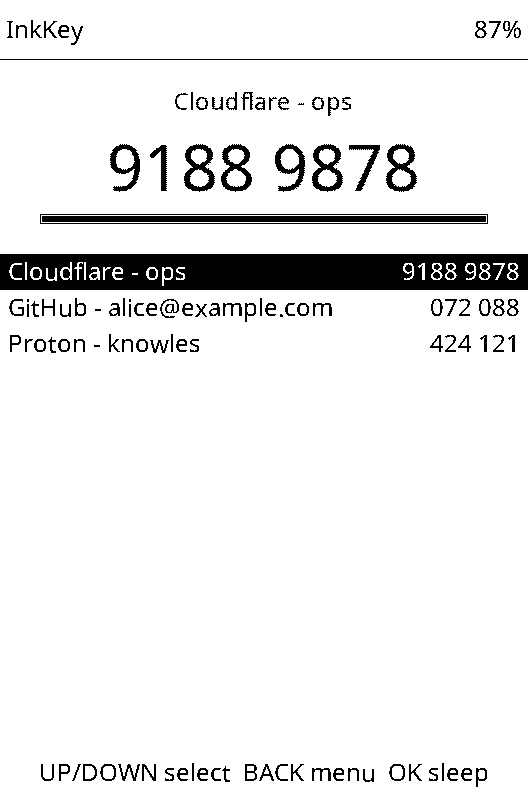
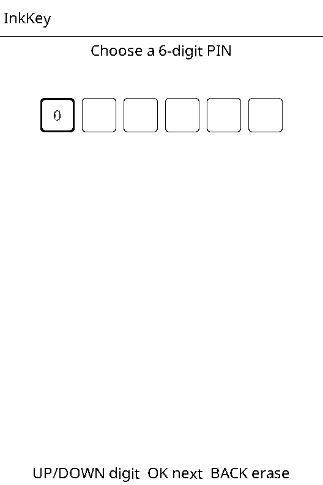
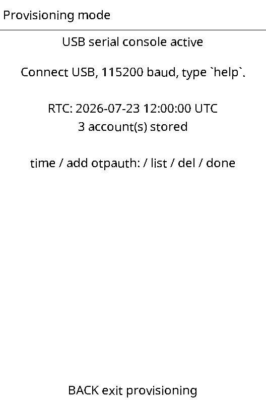

# InkKey 🔑

**An air-gapped TOTP authenticator built from a $50 e-reader.**

InkKey is custom firmware that turns the **Xteink X3** into a dedicated, offline
two-factor authentication token: your 2FA codes on a glanceable, zero-power
e-ink screen, computed from a battery-backed real-time clock, on a device whose
radio is **never turned on**.

<p align="center">
  
  
  
</p>

## Why the X3, specifically

TOTP is just `HMAC(secret, time/30)` — the hard part of doing it offline is
**time**. The Xteink X3 carries a **DS3231**, a temperature-compensated RTC
rated at ±2 ppm (about a minute per year), kept alive by its own backup power.
That is the whole trick: set the clock once at provisioning, and the device can
generate correct codes for years without ever hearing from a network.

The X4 has no battery-backed RTC — its internal clock drifts badly in deep
sleep, which would force periodic WiFi/NTP sync and break the security model.
**InkKey therefore supports the X3 only, by design.** Flashed onto anything
without a DS3231 it refuses to operate.

## What it does

- **Up to 24 TOTP accounts** — 6 or 8 digits, SHA-1 or SHA-256, any period
  (Google, GitHub, Proton, AWS, Cloudflare, self-hosted TOTP…).
- **Codes at a glance** — a large hero code for the selected account plus a
  live list of all accounts, with a countdown bar; partial refresh on each 30 s
  rollover.
- **PIN-locked, encrypted vault** — secrets are stored AES-256-GCM-encrypted in
  internal flash, under a key derived from your 6-digit PIN
  (PBKDF2-HMAC-SHA256, 20 000 rounds). Wrong-PIN attempts back off
  exponentially, and the counter survives reboots.
- **Locks itself by physics** — sleep powers RAM down, so the decrypted vault
  and derived key cease to exist. Every wake starts at the PIN screen.
- **One-time USB provisioning** — plug in, type `otpauth://` URIs into a serial
  console, set the clock, unplug. The console is only serviced while the device
  is unlocked *and* in provisioning mode; at all other times serial input is
  drained unread.
- **No radio, provably** — the firmware links no WiFi, no Bluetooth, no
  ESP-NOW code. CI disassembles every build and fails if a radio-init symbol
  appears in the binary.
- **Weeks of battery** — e-ink draws nothing between refreshes; the device
  deep-sleeps after 3 minutes idle (or instantly via the power button).

## What it deliberately does not do

- No QR display of secrets, no export. Secrets go in; only codes come out.
- No HOTP (counter-based) accounts — there is no sane counter-sync story for an
  air-gapped device.
- No clock UI on-device — time is set over USB in UTC, once.

## Flashing

```sh
pip install -U https://github.com/pioarduino/platformio-core/archive/refs/tags/v6.1.19.zip
pio run -e xteink_x3 -t upload
```

(Or grab `firmware.bin` from the latest CI run's artifacts and flash it with
your usual esptool workflow.)

## Provisioning

1. Unlock the device, open **Menu → Provisioning mode**.
2. Connect USB and open a serial terminal at 115200 baud
   (`pio device monitor`, `screen`, PuTTY…).
3. Set the clock — **UTC, not local time**:

   ```
   time 2026-07-23T12:00:00Z
   ```

4. Add accounts by pasting the `otpauth://` URIs your services show behind
   their QR codes:

   ```
   add otpauth://totp/GitHub:you@example.com?secret=XXXXXXXXXXXXXXXX&issuer=GitHub
   ```

5. `list` to verify, `done` to leave provisioning mode, unplug.

Full command reference: `help` in the console, or see
[`src/core/Console.h`](src/core/Console.h).

## Security model (short version)

InkKey's pitch is **dedicated and offline**, not tamper-proof — read
[SECURITY.md](SECURITY.md) before trusting it with anything important. The
headline points:

- The ESP32-C3 has **no secure element**. A sophisticated attacker with
  physical possession and lab equipment can extract the encrypted vault and
  brute-force the 6-digit PIN offline. The PBKDF2 work factor slows this; it
  does not prevent it.
- The air gap is real: after provisioning, nothing enters or leaves the device.
  There is no firmware-update path over the air, no sync, no telemetry.
- Provisioning happens over USB in plaintext — do it from a machine you trust.

## Building & testing

```sh
# Host-side: RFC 4226/6238/2202/4231/8018 vectors + base32 + URI parsing
cd test && g++ -std=c++17 -I../src -o test_totp test_totp.cpp \
    ../src/core/Sha.cpp ../src/core/Totp.cpp && ./test_totp

# Host-side: full firmware simulation — real UI + vault + console against stub
# hardware; writes every e-ink frame as a .pbm image
cd test/host && ./build_sim.sh && ./sim out

# Device firmware
pio run -e xteink_x3
```

The simulator compiles `src/main.cpp` and the real FreeInkUI unchanged, so UI
changes can be reviewed as rendered frames without hardware in the loop.

## Lineage & credits

InkKey is built on the MIT-licensed **[FreeInk SDK](freeink-sdk/)** (display
driver, board profiles, input, RTC, UI toolkit) from the
[crosspoint-reader](https://github.com/crosspoint-reader/crosspoint-reader)
community — the same foundation as [CrossPlant](https://github.com/0xKnowles/CrossPlant),
[CrossInk](https://github.com/uxjulia/CrossInk), and the wider Xteink custom
firmware ecosystem. Panel waveforms trace back to the OpenX4 community SDK; see
[`freeink-sdk/NOTICE`](freeink-sdk/NOTICE). The UI typeface is Noto Sans
(OFL 1.1, see `src/ui/fonts/OFL.txt`).

## License

MIT — see [LICENSE](LICENSE).
