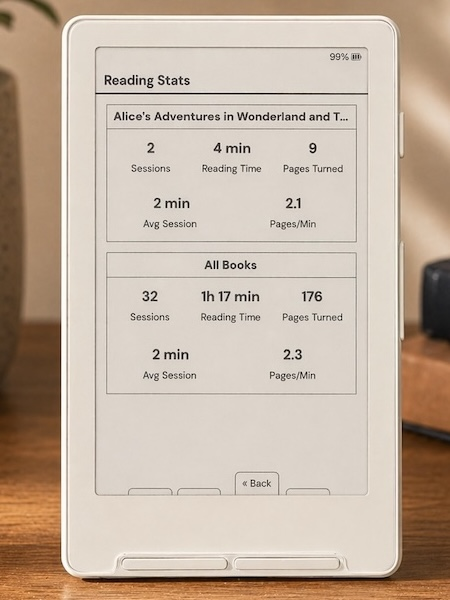

# CrossMerge (PocketPet) 🐣

**CrossMerge** (formerly known as PocketPet) is a custom firmware for the **XTEink X3** and **X4** e-ink readers. It merges the advanced typography, performance optimizations, and stable base of **CrossInk** with the virtual pet mechanics of the community fork **CrossPet**, adding a collection of enhancements, modern UI layouts, and deep reading integrations.

<table>
  <tr>
    <td align="center">
      <br/>
      <em>Stable CrossInk Reader Base</em>
    </td>
    <td align="center">
      <!-- Image generated by developer for reference -->
      <br/>
      <em>Dashboard Stats & Pet Integration</em>
    </td>
  </tr>
</table>

---

## 🐣 The Virtual Pet System (CrossPet Re-engineered)

CrossMerge features a fully integrated virtual pet companion that hatches from an egg and grows as you read. Your reading habits directly sustain your pet!

### Vitals & Care
*   **Decay & Needs**: Your pet's stats (Hunger, Happiness, Health, and Discipline) decay while you are awake. Starvation and sickness will slowly deplete its Health.
*   **Waste & Cleanliness**: Feeding meals increases weight and creates waste piles. Neglecting cleaning makes the pet unhappy and sick.
*   **Missions**: Every day, your pet has three simple daily goals (e.g., read 20 pages, play 3 times, keep fed).
*   **Evolution Branches**: Your pet evolves through stages: *Egg → Hatchling → Youngster → Companion → Elder*. Depending on your reading streaks and completed books, it branches into one of three evolution variants:
    *   **Scholar** 🎓 (High streaks, active reader, books finished)
    *   **Balanced** ⚖️ (Default healthy cycle)
    *   **Wild** 🌲 (Infrequent reading, broken streaks)

---

## 🚀 Advanced Enhancements over CrossPet

CrossMerge overhauls the original pet system with premium features, modern layouts, and rich reading integrations:

### 1. Two-Column UI Overhaul 📱
The Virtual Pet dashboard features a space-efficient two-column layout:
*   **Left Column (Vitals & Status)**: Centered breathing pet sprite, active condition indicators, pet name/stage, compact progress bars for vitals (Hunger, Happiness, Health, Discipline), and your active **Ink Points** balance.
*   **Right Column (Actions & Stats)**: Displays detailed **Reading Partner Stats** (page turns, sessions, streak details) and a scrollable actions menu (Feed, Play, Scold, Lights, rename, etc.).

### 2. Ink Points System & Shop 🛒
Read more to earn points and customize your pet:
*   **Earn Points**: Accumulate **Ink Points (IP)** automatically:
    *   `+1 IP` per page turned
    *   `+100 IP` per book completed
    *   `+1 IP` per 30 seconds of reading duration
    *   `+5 IP` per new reading session started
*   **Ink Shop**: Access the shop to spend points on items:
    *   **Treat Box** (`20 IP`): Restores Hunger and Health.
    *   **Reading Toy** (`50 IP`): A passive item that halves your pet's happiness decay rate.
    *   **Round Glasses** (`100 IP`): Cosmetic accessory.
    *   **Wizard Hat** (`150 IP`): Cosmetic accessory.

### 3. Cosmetic Equipment 🕶️🎩
Buy accessories in the Shop to customize your pet's appearance. Equipped items (Round Glasses, Wizard Hat) render dynamically on top of the pet's pixel-art sprite at all scales.

### 4. Pet Diary Sleep Screen 📓
Sleep screen mode features a dual-pane **Pet Diary**:
*   The left half shows your sleeping pet with its name and stage.
*   The right half renders a ruled notebook diary summarizing the day's achievements (Age, pages read, petted count, general condition, and bedtime synced from the RTC).

### 5. Home Screen & Bezel Key Shortcuts 🕹️
*   **Dashboard Theme**: Displays a mini-sprite and stats (Hunger, Happiness, Health, Stage) in the homepage footer.
*   **Physical Settings Button**: Re-mapped on the Dashboard theme as a fast-track shortcut to open **My Pet** directly. The **Settings** menu is nested inside the Back-button overlay menu instead.
*   **Bezel Long-Press Shortcuts**: Hold down any bezel button (**Confirm, Left, or Right**) for 1 second to instantly jump to your pet screen from anywhere.

---

## 📖 Stable Reader Base Highlights (CrossInk)

- **Reader Typography**: Default fonts replaced with **Lexend Deca** (a research-backed sans-serif designed to improve reading fluency) and **Bitter** (a comfortable slab-serif optimized for digital screens).
- **Thicker Underlines & Strikethroughs**: Improved markup contrast on e-ink displays.
- **Section Breaks & Formatting**: Support for `<hr>` breaks, paragraph indents override, redaction styles, and tables.
- **Reader Modes**: Bionic Reading and Guide Dots toggle.
- **Stats & Syncing**: Sync reading progress and all-time statistics between two devices.

---

## 🛠️ Flashing & Installation

1.  Download the latest `firmware-default.bin` from the releases page.
2.  Connect your X3 or X4 via USB-C.
3.  Flash using the web installer or PlatformIO:
    ```sh
    pio run -e default --target upload
    ```

For detailed instructions, see [Installation](./docs/installation.md).

---

## 💻 Simulator

To test and develop without flashing hardware, compile the device simulator which renders the e-ink screen in an SDL2 window. See [Simulator Guide](./docs/simulator.md).

---

## 📝 Documentation Index

*   [User Guide](./USER_GUIDE.md) - How to navigate and use the reader.
*   [Controls Guide](./docs/controls.md) - Remapping bezel buttons, short power click, and long-press actions.
*   [Developer Getting Started](./docs/contributing/getting-started.md) - Setup, code verification, and guidelines.
*   [Data Cache Layout](./docs/data-cache.md) - Understanding `.crosspoint/` and metadata storage.
